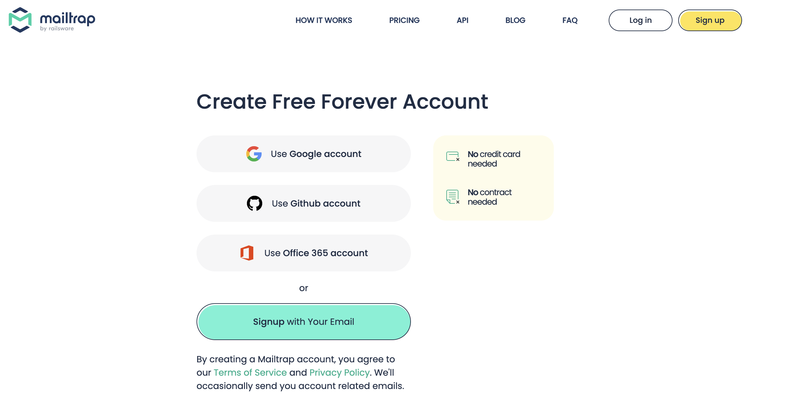
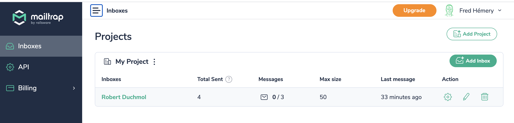
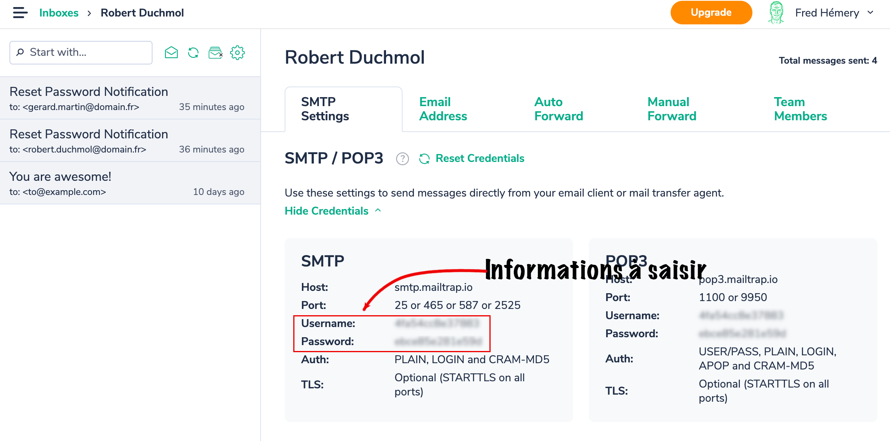

### Site Web Jeux Olympiques

Projet Universitaire : Dans le cadre d'un projet à faire dans une matière .J'ai pu réaliser une application en Php/laravel avec de nouvelles fonctionnalités jamais vues auparavant comme :
- Le changement de mot de passe via un envoie de mail ( utilisation de mailtrap)
- La gestion de role pour un utilisateur 
- Verification d'authentification via une adresse mail ( utilisation de mailtrap)

### Comment lancer l'application 

```shell
cp .env.example .env
composer i
npm i
php artisan key:generate
php artisan migrate
php artisan db:seed
php artisan migrate:fresh
php artisan serve
npm run dev 
```
# Important 

Pour pouvoir utiliser l'application vous devrez vous faire un compte mailtrap et changer dans le fichier .env 

1.Création d’un compte


2.Configuration d’une adresse


3.Identifiant de l’adresse


```shell
MAIL_MAILER=smtp  
MAIL_HOST=smtp.mailtrap.io  
MAIL_PORT=2525  
MAIL_USERNAME=<********> //Your Mailtrap username  
MAIL_PASSWORD=<********> //Your Mailtrap password
MAIL_ENCRYPTION=tls
```

### Pour pouvoir avoir accès à toutes les fonctionnalités

Pour vous connecter en tant qu'admin appuyer sur connecter et entrer les valeurs suivantes :

*email : robert.duchmol@gmail.com

*mot de passe : GrosSecret
    
